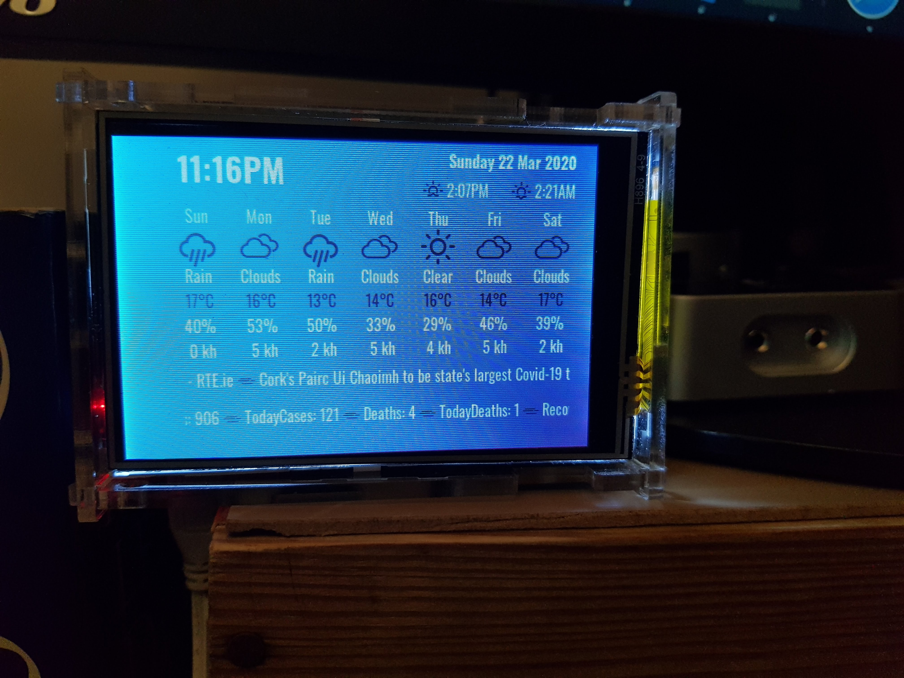
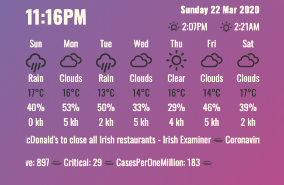

# Raspberry Pi Station

A while ago, I programmed some automation Python script on my Raspberry Pi, and installed a cheap 3" screen on it not to need the big monitor.
The new screen doesn't turn off unless I make a hardware shield for it, so I made a use of it to display time, weather, and latest news all the time.

Today I added a COVID-19 tracker to it.

### Features:
* Display time and date.
* Show latest news by country.
* Show weather in a city.
* Show latest COVID-19 cases in a country.
* Updates data every half hour.

### How to:
* Clone the script to your server.
* Insert country / city details.
* Visit [Open Weather Map](https://openweathermap.org) and get an ID for the API. 
* Visit [News API](https://newsapi.org) and get an API Key. 

### Working:

---
